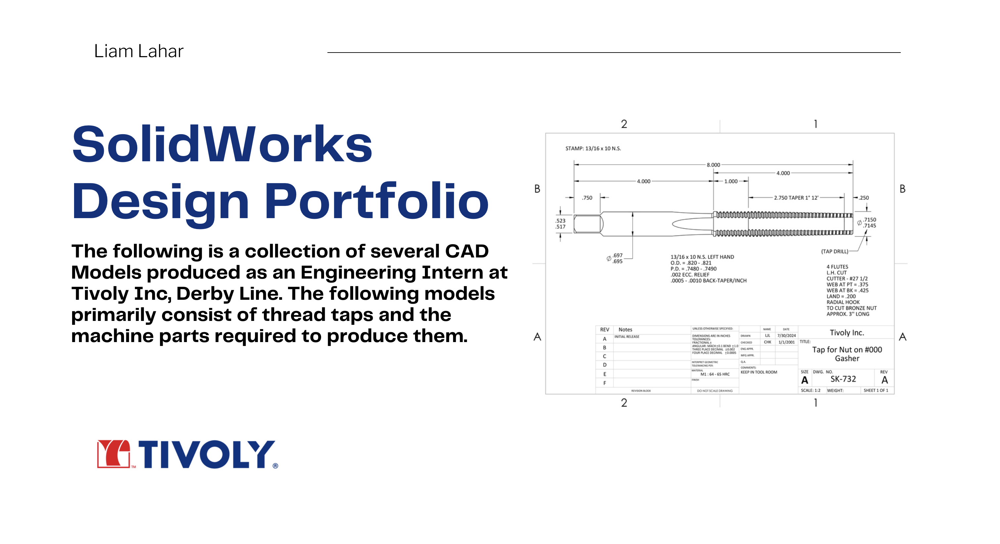

# Tivoly Engineering Internship

During my Summer 2024 internship at Tivoly, I created over 200 SolidWorks CAD models and accompanying 2D schematics of thread taps and machine parts to support toolmakers and reduce part failure–related delays.

A summary of this work is available here (click image or link to view):  

**[SolidWorks Design Portfolio – Canva](https://solidworks-design-portfolio-liamlahar.my.canva.site/)**

